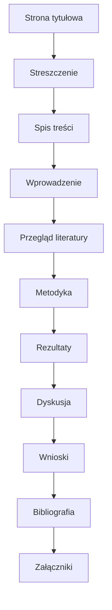

% Model pisania pracy inżynierskiej - Uniwersytet Kazimierza Wielkiego

## Cel dokumentu

Ten dokument przedstawia kompleksowy, praktyczny model tworzenia pracy inżynierskiej zgodny z ogólnymi standardami akademickimi stosowanymi na polskich uczelniach. Treść jest w języku polskim i zawiera czytelne diagramy ułatwiające planowanie oraz przykład szablonu rozdziałów. Dokument unika użycia znaków Pauzy i Półpauzy.

## Instrukcje dla agenta

* Generuj diagramy w notacji Mermaid (https://mermaid.js.org/).
* Umieszczaj diagramy w blokach kodu oznaczonych ```mermaid``` aby mogły być wyrenderowane przez narzędzia wspierające Mermaid.
* Pod każdym diagramem dodaj krótki opis alternatywny (1-2 zdania) dla czytelników/rendererów, które nie obsługują Mermaid.
* Jeśli diagram jest duży lub wymaga eksportu, dołącz również prosty tekstowy wariant (lista kroków) lub link do pliku obrazu.

## Szybki plan pracy

1. Wybór tematu i promotora
2. Analiza literatury i sformułowanie celu pracy
3. Metodologia i plan badań
4. Realizacja badań i analiza wyników
5. Opracowanie rozdziałów wynikowych
6. Redakcja, formatowanie i przygotowanie do złożenia

## Struktura pracy - szablon rozdziałów

1. Strona tytułowa (określona przez wydział)
2. Oświadczenie o samodzielności
3. Streszczenie w języku polskim i angielskim
4. Spis treści
5. Wykaz skrótów i symboli
6. Wprowadzenie
7. Przegląd literatury
8. Cel pracy i zadania badawcze
9. Metodyka i narzędzia
10. Wyniki
11. Dyskusja wyników
12. Wnioski i rekomendacje
13. Bibliografia
14. Załączniki

## Szczegółowe wytyczne formatowania

* Czcionka: Times New Roman lub podobna szeryfowa
* Rozmiar czcionki: 12 punktów dla tekstu zasadniczego
* Interlinia: 1.5
* Marginesy: standardowo 2.5 cm z każdej strony
* Numeracja stron: arabskie cyfry, zaczyna się od pierwszej strony tekstu
* Wcięcia akapitowe: 1.25 cm lub brak wcięcia z odstępami między akapitami
* Wykresy i rysunki: podpis pod rysunkiem, numer rozdziału kropka numer rysunku np 3.1
* Tabele: podpis nad tabelą lub pod nią zgodnie z wytycznymi wydziału

## Zasady cytowania i bibliografia

* Uczelniane preferencje cytowania mogą się różnić. Jeśli brak lokalnych zasad stosuj jeden z popularnych stylów: APA, IEEE lub Harvard
* W tekście: cytat w linii z odwołaniem do pozycji bibliograficznej lub nazwiskiem i rokiem w nawiasie
* W bibliografii: uporządkowany alfabetycznie wykaz pozycji, format zgodny ze stylem cytowania
* Przy cytowaniu źródeł elektronicznych podaj adres URL i datę dostępu

## Diagramy i rysunki

Poniższe diagramy są przykładami estetycznych i czytelnych schematów pomagających zorganizować proces tworzenia pracy. Można je tworzyć w narzędziach typu draw.io lub w notacji mermaid.

### Diagram procesu powstawania pracy (mermaid)


### Diagram struktury dokumentu (mermaid)



## Przykładowy opis rozdziału Metodyka

1. Cel rozdziału: przedstawienie podejścia badawczego i narzędzi
2. Opis środowiska badawczego: stanowisko testowe, oprogramowanie, sprzęt
3. Procedury: kroki wykonawcze i parametry eksperymentów
4. Metryki: miary używane do oceny rezultatów
5. Sposób analizy: techniki statystyczne lub algorytmy przetwarzania danych

## Estetyka i czytelność

* Utrzymuj jednolity styl nagłówków rozdziałów i podrozdziałów
* Stosuj numerację rozdziałów i podrozdziałów: 1. 1.1 1.2 2. itd
* Rysunki i tabele numeruj zgodnie z rozdziałem
* Unikaj nadmiernego zatłoczenia tekstu wykresami

## Kontrola wersji i przygotowanie do złożenia

* Utrzymuj historię zmian w systemie kontroli wersji git
* Przygotuj finalny plik PDF do druku
* Zachowaj kopię edytowalną np w formacie DOCX

## Checklista przed złożeniem

1. Sprawdzenie formatu czcionki i marginesów
2. Sprawdzenie numeracji stron i spisu treści
3. Weryfikacja bibliografii i poprawności cytowań
4. Pełny opis metod i wyników
5. Dołączenie załączników z danymi surowymi

## Wskazówki praktyczne dla promotora i studenta

* Uzgodnij wzorzec strony tytułowej z wydziałem
* Regularne konsultacje postępów pracy
* Archiwizuj wersje robocze przed istotnymi zmianami

## Załączniki i materiały dodatkowe

* Szablony dokumentów
* Przykładowe pliki z danymi i kodem

---

Dokument może zostać dostosowany do szczegółowych wytycznych wydziału Uniwersytetu Kazimierza Wielkiego. Na prośbę mogę przygotować szablon strony tytułowej oraz wersję DOCX gotową do edycji.
